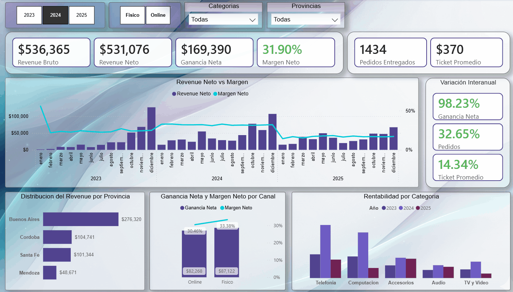
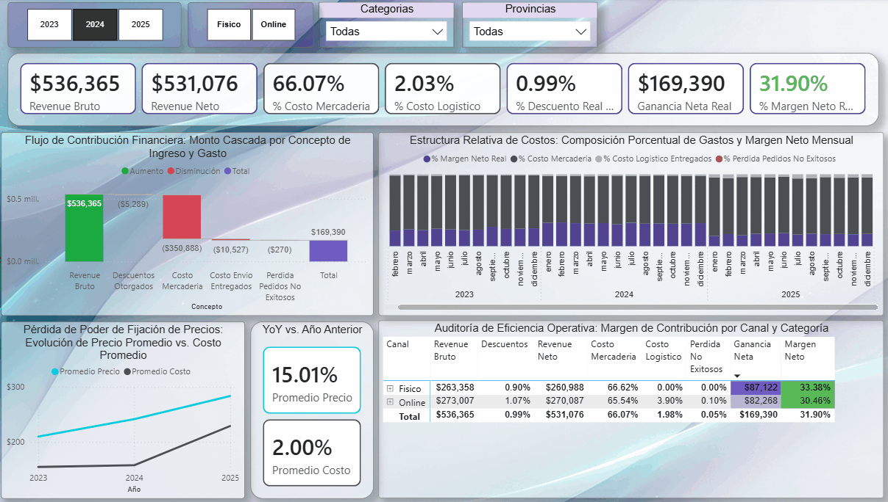
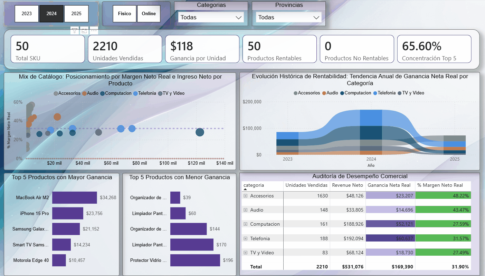
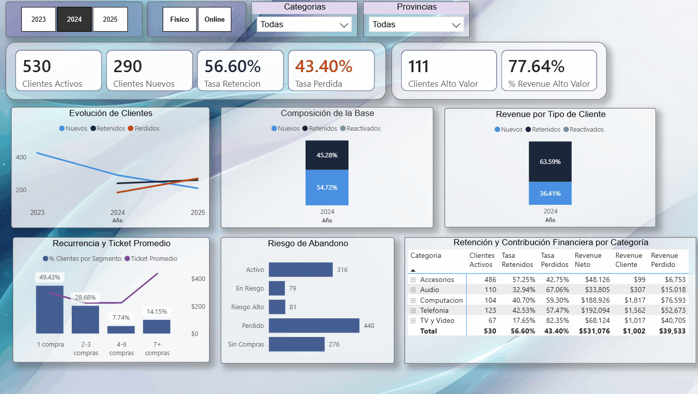
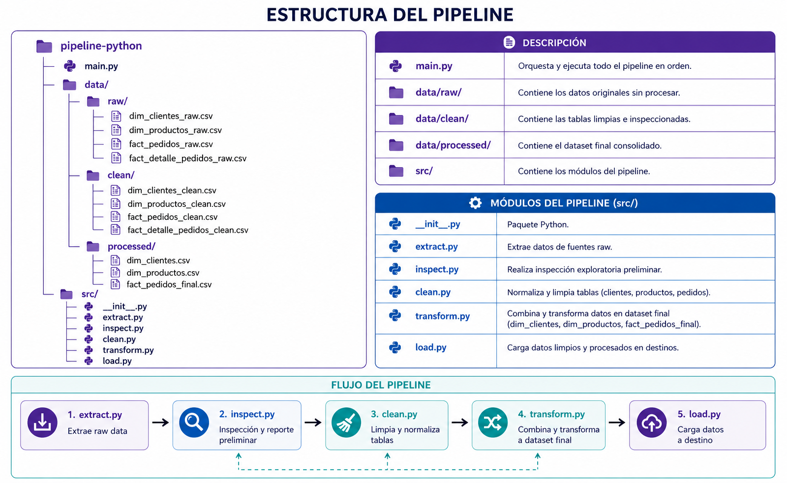
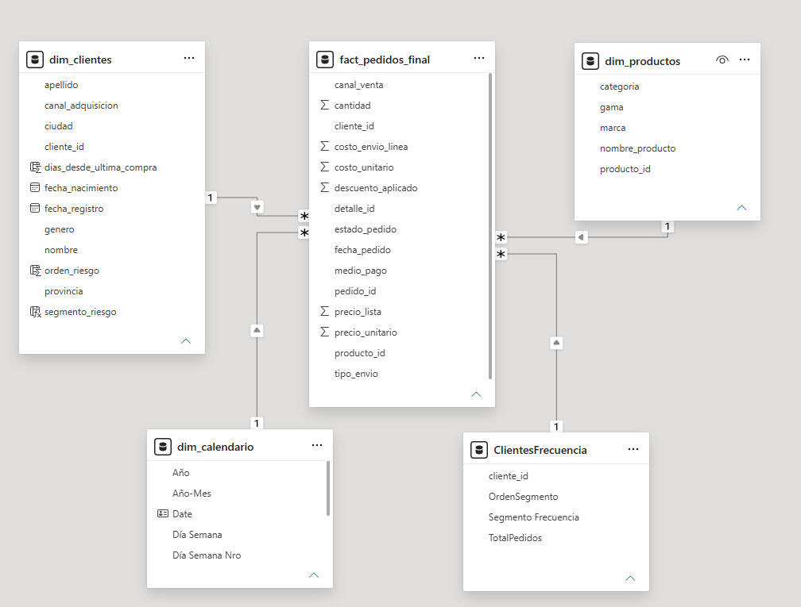

# Technoshop | Análisis de Negocio *End-to-End*

**Objetivo:** Identificar las causas raíz de la caída de rentabilidad de una empresa retail tecnológica (2023-2025) y hacer recomendaciones basadas en datos que lleven a tomar mejores deciciones estrategicas.  

**Stack Técnico Principal:**
     

---

## 📈 Resumen de la Crisis e Impacto Financiero

El volumen de pedidos se mantiene estable (**+3.07%**), pero el negocio experimenta una fuerte destrucción de valor: la **Ganancia Neta** se derrumbó un **-57.11%** debido a *shocks* de costos de proveedores (**+45.08%** YoY) y costos logísticos del *canal online* que canibalizan el margen de productos masivos.

---

## 📊 Análisis detallado (Reporte Power BI):

<b>1. Vista Ejecutiva — ¿Qué pasó con el negocio? (Clic para ver)</b>

* Al cierre del año fiscal 2025, la fuerza operativa se mantiene saludable, registrando un incremento del **+3.07%** en pedidos entregados (**1,434** vs. **1,478** órdenes).  
* La **Ganancia Neta** se derrumbó un **-57.11%** (de $169,390 a $72,654) y el **Margen Neto Real** se redujo a la mitad (de **31.90%** a **16.90%**).  
* Se observa un traslado de la operación del *canal físico* al *online* con una caída del **Ticket Promedio** de **21.47%**.

<b>2. Diagnóstico de Rentabilidad — ¿Por qué cayó la rentabilidad? (Clic para ver)</b>

* La participación del **Costo de Mercadería** saltó del **66.07%** al **78.84%** (**+12.77** p.p.), aplastando el margen de ganancia para 2025.  
* En 2025 la tendencia de precios se invirtió: los costos de proveedores explotaron un **+45.08%** (YoY) y el *retail* solo pudo ajustar precios un **+17.39%** para no destruir la demanda.  
* El crecimiento del *canal online* triplicó su facturación (**$313K**), pero disparó el costo de envíos global del negocio del **2.03%** al **4.25%**, canibalizando la utilidad neta.

<b>3. Performance de Productos — ¿Dónde conviene intervenir? (Clic para ver)</b>

* El **Costo de la Mercadería** de categorías de alto *ticket* (*Computación*, *Telefonía* y *TV/Video*) empujó sus márgenes netos por debajo de la media (incluso a margen negativo), convirtiéndose en los principales causantes de la crisis.
* La categoría *Accesorios* escaló al primer lugar en contribución de ganancias en 2025 (**$22,092**) gracias a un colchón de margen original más alto y un incremento en unidades vendidas. 
* Los productos masivos pero baratos (como *Organizador de Cables* o *Limpiador de Pantallas*) operan con ganancia neta negativa en el *canal online*, debido a que el envío fijo devora el margen.

<b>4. Retención de Clientes — ¿Qué hacer con la base de clientes? (Clic para ver)</b>

* El negocio experimenta una contracción de **Clientes Activos** (de **530** a **472**) y la **Tasa de Pérdida** (*churn*) trepó al **50.94%**, superando por primera vez a la **Tasa de Retención**.  
* Para 2025 el porcentaje de **Clientes Retenidos** aumenta su proporción en la base (del **45.28%** al **68.77%**) y aportan el **68.77%** del *revenue*. Los **Clientes Nuevos** caen todos los años.  
* *Computación* y *TV/Video* son las categorías que más clientes pierden (**84.62%** y **80.60%** respectivamente), representando el mayor *revenue* potencial perdido.
* Los clientes con más frecuencia de compra son también los de mayor **Ticket Promedio**, y estos aumentaron para 2025.

---

## 🎯 Plan de Recomendaciones Estratégicas 

* **Prioridad alta (Corto plazo):** Reestructurar contratos con proveedores de *Computación* y *TV/Video* (costos actuales del **88%** vuelven inviable la categoría) e implementar un monto mínimo de compra *online* para diluir el impacto del envío fijo en *Accesorios*.
* **Prioridad media (Mediano plazo):** Lanzar planes de fidelización enfocados en la base de **Clientes Retenidos**, ya que operan como el motor principal del negocio (aportando el **68.77%** del *revenue* y registrando la mayor frecuencia de compra y **Ticket Promedio**). Dentro de esta estrategia, la acción inmediata es blindar a los **97** *Clientes de Alto Valor* que concentran el **73%** de la facturación. Una vez asegurada esta retención, se recomienda reactivar la captación de clientes nuevos para revertir su tendencia a la baja interanual que amenaza la salud del negocio a largo plazo. Asimismo, se sugiere automatizar estrategias de *cross-selling* hacia categorías eficientes como *Audio* (**28.20%** de margen).
* **Prioridad baja (Largo plazo):** Evaluar la reconversión de tiendas físicas ineficientes en centros de despacho logísticos, dado que el *canal físico* redujo su ganancia neta a un tercio y el *online* concentra el grueso del *revenue* (**$313K**).

---

## ⚙️ Ingeniería de Datos y Arquitectura

En esta sección se detalla el procesamiento técnico que hace posible la veracidad del análisis de negocio expuesto arriba.

<b>🐍 1. *Pipeline* modular de limpieza y preparación (Python y Pandas)</b>

Para garantizar la calidad de los datos y la consistencia del análisis antes de ser consumidos por el modelo de BI, desarrollé un *pipeline* automatizado, modular y eficiente:

* **`inspect.py`:** Módulo encargado de la auditoría inicial de los datos estructurados, detección de valores nulos, duplicados e inconsistencias en los tipos de variables.
* **`clean.py`:** Contiene las funciones de transformación de datos, normalización de texto y manejo de variables de negocio críticas para reflejar los *shocks* de mercado.
* **`main.py`:** El orquestador principal que ejecuta de principio a fin el flujo de ingesta y procesamiento.
* *Nota de arquitectura:* El *dataset* fue generado sintéticamente utilizando la librería *Faker* para simular un ecosistema *retail* omnicanal real.

*Código fuente disponible en la carpeta:* `/python_pipeline`

<b>🛢️ 2. Consultas y modelado analítico (SQL)</b>

Scripts diseñados para responder eficientemente a las preguntas de negocio mediante consultas estructuradas en base de datos:
* Uso de **CTEs** (*Common Table Expressions*) para segmentar y calcular las tasas de retención y pérdida de clientes por año.
* Implementación de agregaciones y uniones complejas (`JOINs`) para consolidar el comportamiento omnicanal cruzando datos de tiendas físicas y plataformas *online*.

*Scripts disponibles en la carpeta:* `/sql_queries`

<b>📐 3. Modelo de datos (Power BI)</b>

El reporte implementa un enfoque de **Esquema en Estrella** (*Star Schema*) óptimo para el rendimiento analítico en DAX:
* **Tabla de hechos:** `fact_pedidos`
* **Tablas de dimensiones:** `dim_productos`, `dim_clientes` y `dim_calendario` (vital para el análisis temporal de variaciones YoY).

---
El proyecto abarca todo el ciclo de vida del dato, pero con el fin de priorizar el valor de negocio, este documento presenta en primera instancia el **Análisis detallado en Power BI y las Recomendaciones Estratégicas**, para pasar luego a los fundamentos técnicos del proyecto (Pipeline ETL en Python y Modelado SQL).

**Entorno de Desarrollo y Base de Datos:**
     

## Contexto de Negocio y Objetivo
La empresa presenta una dinámica particular: el volumen de pedidos se mantiene relativamente estable, pero la rentabilidad cae con fuerza entre 2024 y 2025. A través de un enfoque basado en datos, este reporte desarmará los síntomas financieros macro para encontrar las causas raíz operativas y de comportamiento de clientes para poder hacer recomendaciones estratégicas para la toma de decisiones. 

---

