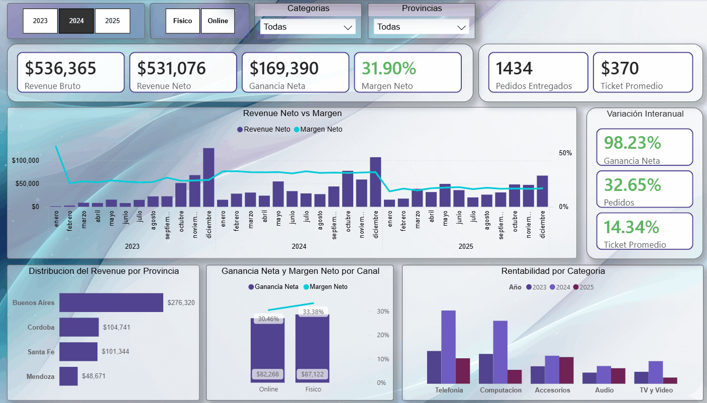
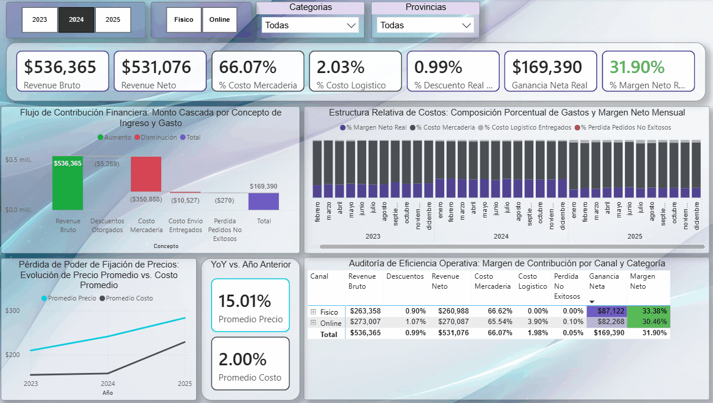
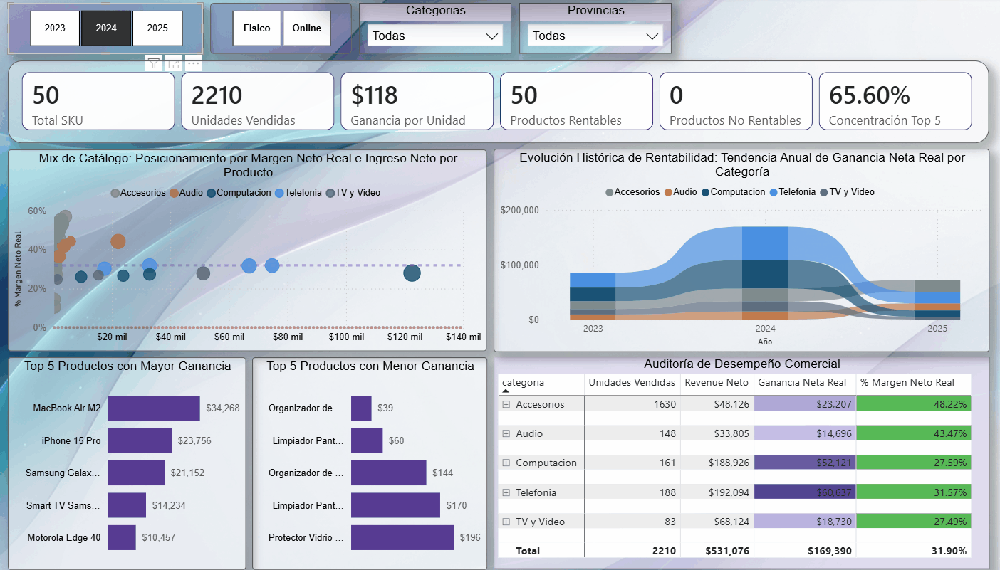
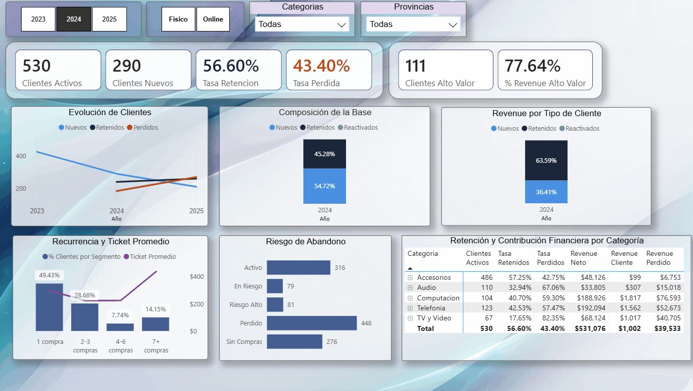
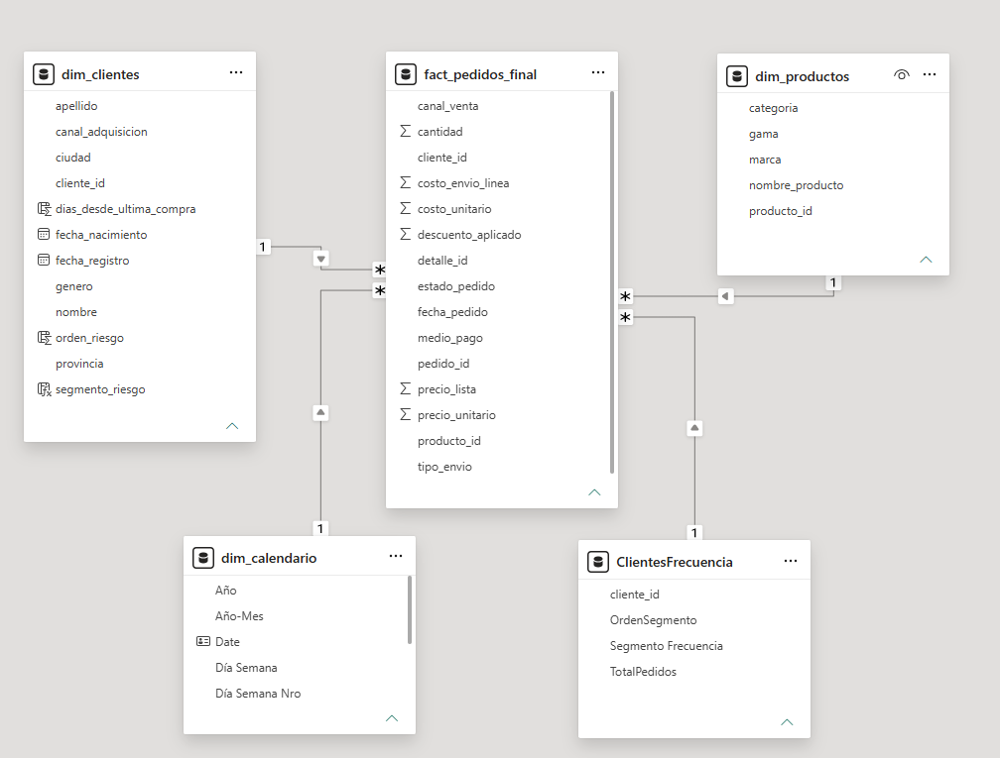

# Technoshop | Análisis de Negocio End-to-End

### Introducción:  
Este proyecto abarca el ciclo completo de un proceso de analítica de datos. Siguiendo el flujo técnico habitual, comprende el desarrollo de un **pipeline ETL modular en Python**, la construcción de **consultas analíticas en SQL** y la elaboración de un **dashboard interactivo en Power BI**, a partir del cual se obtienen conclusiones y recomendaciones estratégicas.  
Con fines de comunicación, este README invierte deliberadamente ese orden para priorizar lo más relevante para el lector: primero presenta los hallazgos y el impacto de negocio con sus correspondientes recomendaciones, y luego describe la arquitectura técnica que permitió obtenerlos.

### Objetivo: 
Identificar las causas raíz de la caída de rentabilidad de una empresa de retail tecnológico entre 2023 y 2025 y elaborar recomendaciones estratégicas basadas en evidencia para apoyar la toma de decisiones.

### Stack Técnico Principal:  
     

---

## Problema de Negocio

Si bien el volumen de pedidos se mantiene estable, el negocio experimenta una fuerte destrucción de valor: la **Ganancia Neta** se derrumbó un **-57.13%**.  

## Preguntas de Negocio y Hallazgos (Reporte Power BI)

<b>1. Vista Ejecutiva — ¿Qué pasó con el negocio? (Clic para expandir)</b>
 

Al cierre del año fiscal 2025, el volumen operativo general se mantiene estable con un incremento del **+3.07%** en pedidos entregados (**1,478 vs. 1,434** del periodo anterior). Sin embargo, la **Ganancia Neta** global se derrumbó un **-57.13%** (de $169,402 a $72,627) y el **Margen Neto Real** se redujo a la mitad, cerrando en un **16.90%**. 

Este resultado responde a dinámicas opuestas por canal: el **Canal Físico sufrió una contracción del -71.69% en su Ganancia Neta** explicada por la pérdida de escala, al desplomarse sus pedidos (**422 vs. 641**) y su Ticket Promedio un **-32.49%** ($275). En contraste, la demanda migró masivamente hacia el **Canal Online**, el cual actuó como motor de volumen expandiendo sus órdenes (**1,056 vs. 793**) y registrando un **Revenue Neto de $313,791** con un Ticket Promedio superior ($297).

<b>2. Diagnóstico de Rentabilidad — ¿Por qué cayó la rentabilidad? (Clic para expandir)</b>
 
  
La rentabilidad global fue fuertemente erosionada en dos frentes:  

* **Deterioro de la relación precio–costo:** El **% Costo de Mercadería** general saltó del **66.07% al 78.85% (+12.78 p.p.)**. Este impacto afectó por igual a la estructura de ambos canales (ambos en ~78.9%), debido a que los costos de proveedores explotaron un **+45.08% (YoY)** y el *retail* solo pudo indexar precios un **+17.39%** para proteger la demanda.
* **Fuga Logística Digital:** El **% Costo Logístico** consolidado del negocio aumentó del **1.98% al 4.13% (+2.15 p.p.)**. Al analizar de forma aislada el **Canal Online**, este indicador específico escala hasta el **5.66%**, lo que significa que el canal que sostuvo el volumen del negocio fue también el que absorbió la mayor penalización en por costos de envío, reduciendo su propio margen neto (15.29%).

<b>3. Performance de Productos — ¿Dónde conviene intervenir? (Clic para expandir)</b>
 

* **Crisis en Categorías Core:** Las categorías de alto ticket (*Computación*, *Telefonía* y *TV/Video*) sufrieron un colapso en su rentabilidad, cerrando todas **por debajo de la media global (16.90%)**. Si bien en la vista consolidada defienden márgenes positivos bajos, la presión inflacionaria de los proveedores reduce severamente su colchón de ganancia, destacando *TV/Video* con apenas un **8.29% de margen neto** dentro del canal digital.
* **Mitigación y Dispersión en Accesorios:** La categoría *Accesorios* es el principal pulmón financiero del negocio en el entorno digital, aportando **$12,915 en Ganancia Neta** con un sólido **27.64% de margen** y **1,300 unidades vendidas**. Sin embargo, el reporte revela una **alta variación interna**: mientras algunos artículos sostienen el negocio, la categoría concentra la mayor cantidad de productos con margen negativo debido a la brecha de precios entre sus componentes.
* **Efecto Envío Fijo (Canal Online):** Al analizar de forma aislada la operación digital, el tablero enciende las alarmas al registrar **5 Productos No Rentables**. El gráfico de dispersión (*Mix de Catálogo*) muestra de forma explícita cómo múltiples artículos masivos de bajo precio cruzan la barrera del 0% hacia terreno negativo. Al auditar el *Top 5 con Menor Ganancia*, se identifica la fuga de valor liderada por el *Organizador de Cables* **($85)**, *Limpiador de Pantallas* **($50)** y *Chromecast Google TV* **($22)**, confirmando que la estructura de fletes fijos devora la totalidad del margen de los productos económicos.

<b>4. Retención de Clientes — ¿Qué hacer con la base de clientes? (Clic para expandir)</b>
 

* **Contracción de la base:** Los **Clientes Activos** disminuyeron de **530 a 472**, impulsados por una **Tasa de Churn (Pérdida)** que trepó al **50.94%**, superando por primera vez a la Tasa de Retención.
* **Dependencia de la retención:** Durante 2025, los **Clientes Retenidos** aumentaron su peso en la base (del **45.28% al 55.08%**), aportando el **68.77%** del *revenue* total. En contraste, la adquisición de **Clientes Nuevos** muestra una caída consecutiva año a año.
* **Fuga de Revenue por Categoría:** *Computación* y *TV/Video* registran la mayor pérdida de clientes (**84.62% y 80.60%** respectivamente), consolidándose como las categorías con mayor impacto en el costo de oportunidad del negocio.
* **Correlación de Valor:** Los clientes con mayor frecuencia de compra registran también el **Ticket Promedio** más alto, métrica que mostró un incremento saludable durante 2025.

## Recomendaciones Estratégicas 

* **Prioridad Alta (Corto Plazo):** 
  * Reestructurar contratos con proveedores de *Computación* y *TV/Video* (los costos actuales del **88%** vuelven inviable la operación de estas categorías).
  * Implementar un **monto mínimo de compra** en el *canal online* para diluir el impacto del envío fijo en productos de ticket bajo (*Accesorios*).
* **Prioridad Media (Mediano Plazo):** 
  * Lanzar planes de fidelización enfocados en la base de **Clientes Retenidos**, ya que operan como el motor principal del negocio (aportan el **68.77%** del *revenue*).
  * **Acción inmediata:** Blindar a los **97 Clientes de Alto Valor** que concentran el **73% de la facturación**. 
  * Reactivar de forma controlada la captación de clientes nuevos para revertir la tendencia a la baja interanual.
  * Automatizar estrategias de *cross-selling* desde productos de bajo margen hacia categorías eficientes como *Audio* (**28.20% de margen**).
* **Prioridad Baja (Largo Plazo):** 
  * Evaluar la reconversión de tiendas físicas ineficientes en centros de despacho logísticos, dado que el *canal físico* redujo su ganancia neta a un tercio y el *online* ya concentra el grueso del revenue (**$313K**).

---

## ⚙️ Ingeniería de Datos y Arquitectura

<b>🐍 Pipeline ETL modular (Python + Pandas)</b>

 

Garantiza la calidad de los datos y la consistencia del análisis antes de ser utilizados en SQL o BI.

#### Características del pipeline

- **Arquitectura modular y escalable:** cada etapa del proceso se encuentra desacoplada en módulos independientes y organizada mediante funciones auxiliares y orquestadores por entidad.
- **Trazabilidad:** todas las anomalías detectadas y las acciones de limpieza se registran mediante logs estandarizados con información sobre el origen del problema.
- **Reporte estructurado:** la auditoría genera automáticamente un reporte consolidado en formato JSON con los principales hallazgos de calidad de datos.
- **Separación de responsabilidades:** las tareas de extracción, auditoría, limpieza, transformación y carga permanecen aisladas, facilitando el mantenimiento y la extensión del pipeline.

 

  

#### Detalle de los módulos Principales del Pipeline:

<b>├──🔍 <code>inspect.py</code> — Auditoría de Calidad de Datos (Data Quality Assessment)</b>

 

Realiza una auditoría integral de calidad de los datos antes de iniciar el proceso de limpieza. Todos los hallazgos se registran mediante logs en terminal y se consolidan en un reporte estructurado en formato JSON.

 

<b>Controles implementados</b>

 

<b>Calidad técnica</b>

<ul>
  <li>Espacios en blanco en los bordes de los textos y registros compuestos únicamente por espacios.</li>
  <li>Valores nulos.</li>
  <li>Consistencia de mayúsculas y minúsculas en variables categóricas.</li>
  <li>Duplicados exactos.</li>
  <li>Duplicados de claves primarias (<code>PK</code>).</li>
  <li>Duplicados de negocio (por subconjuntos de columnas).</li>
  <li>Valores de fecha con formato inválido o no parseables.</li>
</ul>

<b>Reglas de negocio</b>

<ul>
  <li>Validaciones específicas para cada entidad, como costos superiores al precio de venta, fechas cronológicamente inconsistentes, estados inválidos y valores fuera de los dominios permitidos.</li>
</ul>

<b>Integridad referencial</b>

<ul>
  <li>Verificación de que todas las claves foráneas (<code>FK</code>) existan en sus correspondientes tablas de dimensión (<code>PK</code>).</li>
</ul>

<b>├──🧼 <code>clean.py</code> — Limpieza, Normalización e Integridad de Datos</b>

 

Implementa la etapa de limpieza mediante funciones modulares y orquestadores específicos para cada tabla. El módulo corrige, imputa, neutraliza o descarta anomalías según su naturaleza, preservando la trazabilidad mediante logs estandarizados.

 

<b>Acciones implementadas</b>

 

<b>Calidad técnica</b>

<ul>
  <li>Elimina espacios en blanco en los bordes de las columnas de texto.</li>
  <li>Convierte cadenas vacías o compuestas solo por espacios en valores nulos reales (<code>NA</code>).</li>
  <li>Normaliza el formato de texto mediante <code>Title Case</code> para columnas descriptivas y mayúsculas para identificadores terminados en <code>_id</code>.</li>
  <li>Elimina duplicados exactos, colisiones de clave primaria y duplicados definidos por claves de negocio, conservando la primera ocurrencia.</li>
  <li>Convierte columnas de fecha a tipo <code>datetime</code> mediante parseo seguro.</li>
  <li>Neutraliza fechas inválidas, no parseables o futuras mediante <code>NaT</code>.</li>
</ul>

<b>Tratamiento de valores nulos</b>

<ul>
  <li>Descarta registros que no poseen claves primarias o identificadores esenciales.</li>
  <li>Imputa variables categóricas faltantes con el valor <code>Sin Dato</code>.</li>
  <li>Reconstruye nombres de productos faltantes mediante una etiqueta sintética basada en marca e identificador.</li>
  <li>Incorpora un cliente de contingencia con ID <code>-1</code> para preservar pedidos sin cliente válido.</li>
  <li>Completa cantidades y descuentos faltantes con valores operativos por defecto.</li>
  <li>Reconstruye precios unitarios cuando existen precio de lista y descuento.</li>
  <li>Imputa precios y costos faltantes mediante medianas históricas por producto y año, utilizando como respaldo la mediana por categoría y año.</li>
  <li>Descarta líneas transaccionales cuyos valores monetarios no pueden ser recuperados.</li>
</ul>

<b>Reglas de negocio por entidad</b>

<ul>
  <li><b>Productos:</b> valida que la gama pertenezca al dominio permitido y reasigna los valores inválidos a <code>Sin Dato</code>.</li>
  <li><b>Clientes:</b> neutraliza fechas de nacimiento que generen edades fuera del rango de 0 a 100 años y corrige registros anteriores al nacimiento.</li>
  <li><b>Pedidos:</b> fuerza costo de envío igual a cero para órdenes canceladas y retiros en tienda, e imputa costos logísticos inválidos mediante medianas por año y modalidad de entrega.</li>
  <li><b>Detalle de pedidos:</b> corrige cantidades no positivas, imputa precios y costos inválidos mediante medianas históricas y recalcula el precio unitario según el descuento aplicado.</li>
  <li>Genera un indicador de margen negativo para identificar líneas en las que el precio de venta resulta inferior al costo unitario.</li>
</ul>

<b>Integridad referencial</b>

<ul>
  <li>Reasigna pedidos con clientes inexistentes al cliente de contingencia <code>-1</code>, evitando perder métricas de facturación.</li>
  <li>Elimina líneas de detalle huérfanas que no poseen un pedido padre válido.</li>
  <li>Elimina líneas asociadas a productos inexistentes en la dimensión de productos.</li>
</ul>

<b>Orquestación</b>

<ul>
  <li>Define funciones orquestadoras independientes para productos, clientes, pedidos y detalle de pedidos.</li>
  <li>Ejecuta la limpieza en un orden controlado para respetar las dependencias entre dimensiones y tablas de hechos.</li>
  <li>Consolida el proceso completo mediante una función maestra que devuelve todas las tablas limpias y listas para la etapa de transformación.</li>
</ul>

<b>├──⚙️ <code>transform.py</code> — Transformación y Consolidación de Hechos</b>

 

Aplica la lógica de negocio final y consolida el dataset antes de la carga, ejecutando la transición hacia un modelo dimensional optimizado.

 

<b>Acciones implementadas</b>

<ul>
  <li><b>Desnormalización Transaccional:</b> Combina mediante un proceso de cruzado (<code>Merge</code>) las tablas limpias de <code>fact_pedidos</code> y <code>fact_detalle_pedidos</code>, generando la entidad unificada <code>fact_pedidos_final</code> a nivel de línea transaccional.</li>
  <li><b>Preparación Dimensional:</b> Estructura de forma definitiva los archivos maestros de clientes y productos que alimentarán de forma óptima el posterior modelo en estrella de Power BI.</li>
</ul>

<b>├──🚀 <code>load.py</code> — Carga de Datos en Destinos</b>

 

Responsable de la etapa final (Load). Exporta el set de datos transformado y validado hacia la carpeta de almacenamiento final (<code>data/processed/</code>) y orquesta la actualización de los destinos analíticos.

*Código fuente disponible en la carpeta:* [`/pipeline_python`](./pipeline_python/README.md)

<b>🛢️ Investigación analítica y modelado (SQL)</b>
 

Se construyó una View analítica (fact_pedidos_analitica) sobre la tabla de hechos para centralizar la lógica de negocio y las principales métricas de rentabilidad.

A partir de esta capa se desarrolló una investigación SQL progresiva para diagnosticar la caída de rentabilidad, analizando:

Evolución del negocio → Costos → Pricing → Mix → Canal → Producto

El análisis permitió identificar como principales señales de deterioro el aumento del peso del costo de mercadería, la contracción del spread precio–costo y el cambio en el mix de ventas. También se comprobó que el crecimiento del canal Online y el aumento del costo logístico contribuyen al deterioro, pero no explican por sí solos la caída estructural del margen.

### Técnicas SQL aplicadas

- **CTEs (`WITH`)** para estructurar consultas complejas por etapas.
- **Window Functions** (`LAG`, `ROW_NUMBER`) para variaciones interanuales y rankings.
- **JOINs** entre tablas de hechos y dimensiones.
- **Agregaciones y métricas derivadas** para Revenue, costos, margen, mix y rentabilidad.
- **Análisis de participación** sobre unidades y Revenue.
- **Segmentación temporal, por categoría, producto y canal.**
- **Validación cruzada de métricas** entre SQL y Power BI para garantizar consistencia del modelo analítico.

*La investigación completa y los scripts SQL se encuentran en* [`/sql_queries`](./sql_queries/README.md)

<b>📐 Modelo de datos (Power BI)</b>
 

El reporte implementa un enfoque de **Esquema en Estrella** (*Star Schema*) óptimo para el rendimiento analítico en DAX:
* **Tabla de hechos:** `fact_pedidos`
* **Tablas de dimensiones:** `dim_productos`, `dim_clientes` y `dim_calendario` (vital para el análisis temporal de variaciones YoY).

