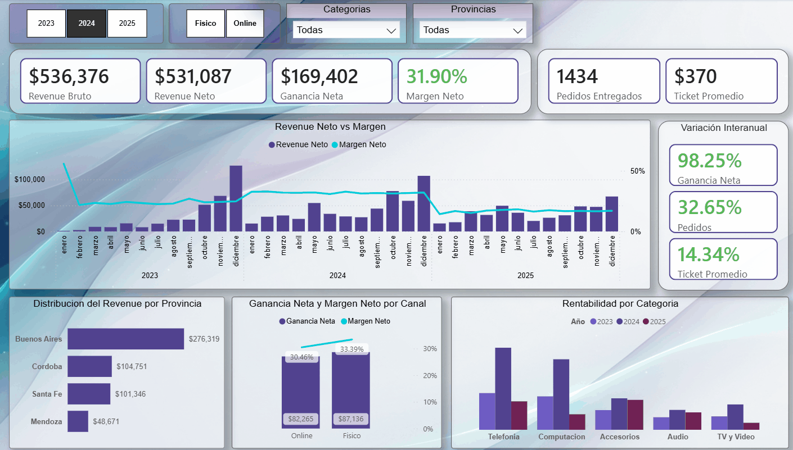
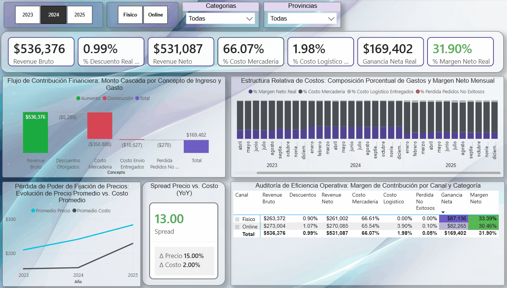
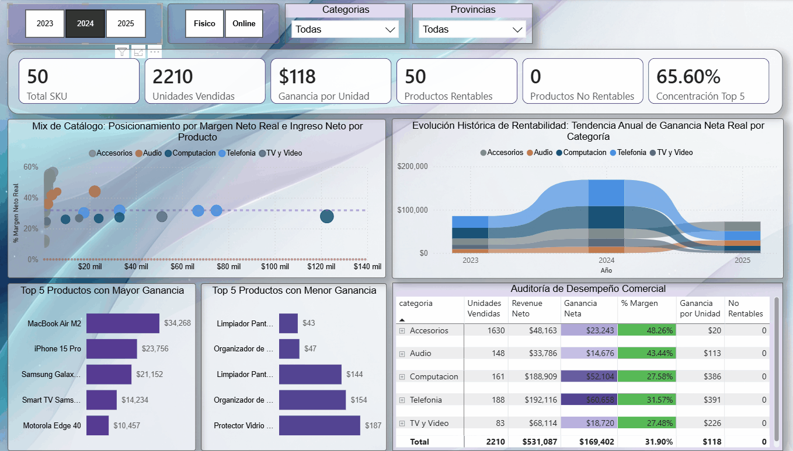
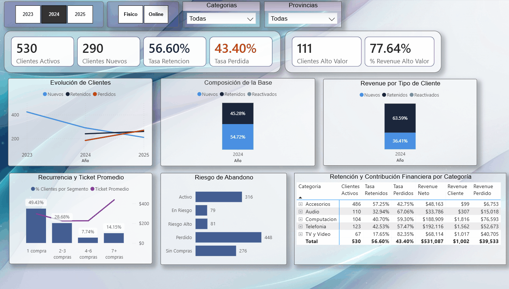
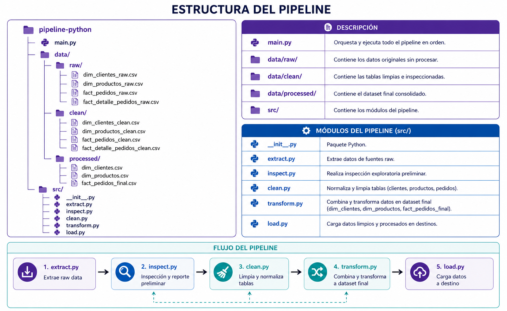

# Technoshop | Análisis de Negocio End-to-End

### Introducción:  
Este proyecto abarca el ciclo completo de un proceso de analítica de datos: desde la construcción de un **pipeline ETL modular en Python**, pasando por la **investigación analítica en SQL**, hasta la elaboración de un **dashboard interactivo en Power BI**, a partir del cual se obtienen conclusiones y recomendaciones estratégicas.  

Para priorizar la perspectiva de negocio, este README presenta primero los hallazgos, el impacto y las recomendaciones, y posteriormente la arquitectura técnica que permitió obtenerlos.

### Objetivo: 
Identificar las causas raíz de la caída de rentabilidad de una empresa de retail tecnológico entre 2023 y 2025 y elaborar recomendaciones estratégicas basadas en evidencia para apoyar la toma de decisiones.

### Stack Técnico Principal:  
      

---

## Problema de Negocio

Si bien el volumen de pedidos se mantiene relativamente estable, el negocio experimenta una fuerte destrucción de valor: la **Ganancia Neta** se derrumbó un **-57.13%**.  

## Storytelling de Negocio — Hallazgos del Análisis en Power BI
<details>
<summary><b>1. Vista Ejecutiva — ¿Qué pasó con el negocio? (Clic para expandir)</b></summary><br>

Al cierre del año fiscal 2025, el volumen operativo general se mantiene relativamente estable, con un incremento del **+3,07%** en los pedidos entregados (**1.478 vs. 1.434** del período anterior). Sin embargo, la **Ganancia Neta** global se derrumbó un **-57,13%**, pasando de **$169.402 a $72.627**, mientras que el **Margen Neto** se redujo casi a la mitad, cerrando en **16,90%**.

Este deterioro presenta **dinámicas opuestas entre canales**:

* El **Canal Físico** sufrió una contracción del **-71,69% en su Ganancia Neta** (**$87.136 vs. $24.667**), acompañada por una fuerte pérdida de escala: sus **pedidos cayeron de 641 a 422 (-34,32%)** y su **Ticket Promedio se redujo un -32,49%**, hasta **$275**.

* En contraste, la demanda migró masivamente hacia el **Canal Online**, que actuó como motor de volumen al expandir sus órdenes de **793 a 1.056 (+33,42%)**. Sin embargo, este crecimiento no se tradujo en mayor rentabilidad: su **Ganancia Neta también cayó un -41,70%**, pasando de **$82.265 a $47.959**, aun con un Ticket Promedio superior (**$297**).

En conjunto, los resultados muestran que **el crecimiento del volumen Online no fue suficiente para compensar la destrucción de rentabilidad en ambos canales**. Esto indica que el deterioro del negocio no responde únicamente a una contracción de la demanda, sino a una **pérdida de rentabilidad por operación**, cuya causa debe analizarse en la estructura de costos y márgenes.



</details>

<details>
<summary><b>2. Diagnóstico de Rentabilidad — ¿Por qué cayó la rentabilidad? (Clic para expandir)</b></summary><br>
  
La rentabilidad global fue fuertemente erosionada por un deterioro estructural de la relación precio–costo, acompañado por un incremento del costo logístico del canal digital.

* **Deterioro de la relación precio–costo:** El **% Costo de Mercadería** sobre el Revenue Neto aumentó del **66,07% al 78,85% (+12,78 p.p.)** entre 2024 y 2025. El deterioro se replica prácticamente por igual en ambos canales: **Físico (66,61% → 78,74%)** y **Online (65,54% → 78,89%)**. La investigación precio–costo muestra el origen del problema: mientras el **precio unitario promedio aumentó un +17,39%**, el **costo unitario promedio creció un +45,08%**, comprimiendo significativamente el spread entre precio y costo **(-27,69 p.p.)**. Este deterioro constituye el **principal factor identificado detrás de la contracción del margen**.

* **Presión logística sobre el canal Online:** El **% Costo Logístico** consolidado aumentó del **1,98% al 4,13%**. El impacto se concentra en el canal Online, donde pasó del **3,90% al 5,66%**. Si bien el canal absorbió el crecimiento de la demanda y elevó su Revenue Neto un **+16,18%**, su Ganancia Neta cayó un **-41,70%** y su Margen Neto se redujo del **30,46% al 15,28%**. La logística, por tanto, actúa como un **factor adicional de erosión del margen**, pero no explica por sí sola el deterioro estructural observado en ambos canales.



</details>

<details>
<summary><b>3. Performance de Productos — ¿Dónde conviene intervenir? (Clic para expandir)</b></summary><br>

* **Crisis en Categorías Core:** Las categorías *Computación*, *Telefonía* y *TV/Video* presentan un fuerte deterioro de rentabilidad y cierran 2025 **por debajo de la media global (16,90%)** en ambos canales. En el entorno Online, sus márgenes se reducen a **9,22%**, **14,06%** y **8,27%** respectivamente. El patrón se replica en el Canal Físico, donde alcanzan **10,49%**, **16,50%** y **11,84%**, evidenciando que el deterioro no responde exclusivamente a la estructura de un canal, sino que afecta transversalmente a estas categorías.

* **Mitigación y dispersión en Accesorios:** *Accesorios* constituye el principal pulmón financiero del Canal Online, aportando **$12.927 en Ganancia Neta**, con un **27,66% de margen** y **1.300 unidades vendidas**. Sin embargo, el análisis a nivel de producto revela una **alta dispersión interna**: dentro de una misma categoría conviven productos con márgenes superiores al **40%** y otros por debajo del **-10%**. Por lo tanto, el buen desempeño consolidado de la categoría **oculta comportamientos muy heterogéneos entre sus productos**, haciendo necesario analizar el catálogo a nivel de SKU para identificar qué artículos sostienen y cuáles erosionan la rentabilidad.

* **Efecto del costo logístico en productos de bajo valor (Canal Online):** La operación digital registra **5 Productos No Rentables**. El análisis del *Mix de Catálogo* muestra que varios productos de bajo precio terminan cruzando la barrera del **0% de margen**, debido al impacto que representa el costo de envío sobre operaciones de bajo valor. Al auditar el *Top 5 con Menor Ganancia*, la fuga de valor está liderada por el *Organizador de Cables* (**-$92**), el *Limpiador de Pantallas* (**-$64**) y el *Chromecast Google TV* (**-$22**). El hallazgo evidencia que, bajo la estructura actual de costos, **el envío fijo puede convertir productos de bajo ticket en operaciones deficitarias**, aun cuando la categoría a la que pertenecen mantenga un margen consolidado positivo.


</details>

<details>
<summary><b>4. Retención de Clientes — ¿Qué hacer con la base de clientes? (Clic para expandir)</b></summary><br>

* **Contracción de la base:** Los **Clientes Activos** disminuyeron de **530 a 472**, impulsados por una **Tasa de Churn (Pérdida)** que trepó al **50.94%**, superando por primera vez a la Tasa de Retención.
* **Dependencia de la retención:** Durante 2025, los **Clientes Retenidos** aumentaron su peso en la base (del **45.28% al 55.08%**), aportando el **68.77%** del *revenue* total. En contraste, la adquisición de **Clientes Nuevos** muestra una caída consecutiva año a año.
* **Fuga de Revenue por Categoría:** *Computación* y *TV/Video* registran la mayor pérdida de clientes (**84.62% y 80.60%** respectivamente), consolidándose como las categorías con mayor impacto en el costo de oportunidad del negocio.
* **Relación entre frecuencia y valor:** Los clientes con mayor frecuencia de compra registran también el **Ticket Promedio** más alto, métrica que mostró un incremento saludable durante 2025.


</details>

*Descargar reporte en Power BI:* [`/technoshop_business_analysis.pbix`](./powerbi/technoshop_business_analysis.pbix)

## 🎯 Recomendaciones Estratégicas Basadas en Evidencia

Para revertir la destrucción de margen y blindar la base operativa del negocio, se propone un plan de acción estructurado por horizontes de impacto:

### 🔴 Prioridad Alta (Corto Plazo): Optimización de Margen y Contención de Fugas
*   **Renegociación Estructural de Sourcing:** Reestructurar de forma urgente los acuerdos comerciales con proveedores clave de *Computación* y *TV/Video*. El **Costo de Mercadería actual (CMV) cercano al 88%** asfixia el spread precio-costo y vuelve inviable la operación comercial de estas categorías core.
*   **Umbral Mínimo de Pedidos (Online Minimum Order Value):** Implementar una política de **monto mínimo de compra** para el canal digital. Esta medida mitiga de inmediato el impacto del costo logístico fijo sobre productos de bajo ticket unitario (*Accesorios*), evitando que operaciones de bajo valor crucen la barrera de rentabilidad.

### 🟡 Prioridad Media (Mediano Plazo): Blindaje de Cartera y Fidelización de Clientes
*   **Programa de Retención de Clientes VIP (Acción Inmediata):** Diseñar una estrategia de retención prioritaria y personalizada para **blindar a los 97 Clientes de Alto Valor**, un segmento hipercrítico que concentra el **73% de la facturación global** del negocio.
*   **Fidelización del Motor del Negocio:** Lanzar planes de lealtad específicos dirigidos a la base de **Clientes Retenidos**, dado que este segmento sostiene la estabilidad de la empresa al aportar el **68.77% del revenue total**.
*   **Algoritmos de Cross-Selling Automatizados:** Implementar motores de recomendación en el checkout online para traccionar ventas cruzadas desde artículos de bajo margen hacia categorías altamente eficientes y saludables, como *Audio* (**28.20% de margen consolidado**).
*   **Adquisición Controlada:** Reactivar paulatinamente los canales de captación de *Clientes Nuevos* bajo métricas estrictas de Costo de Adquisición (CAC), revirtiendo la tendencia a la baja interanual sin presionar el margen operativo.

### 🔵 Prioridad Baja (Largo Plazo): Reingeniería del Modelo de Omnicanalidad
*   **Reconversión Logística del Canal Físico:** Evaluar la transformación estratégica de puntos de venta físicos ineficientes para reconvertirlos en centros de distribución urbana (*Dark Stores* o hubs de despacho local). El canal físico redujo su ganancia neta a menos de un tercio, mientras que el ecosistema Online ya consolida el grueso del volumen de negocio con un **Revenue de $313K**.

---

## ⚙️ Ingeniería de Datos y Arquitectura del Sistema

### Flujo de Datos End-to-End (Data Pipeline)

```text
[ CSVs Locales ] ──( Python / Pandas ETL )──> [ Datasets Clean & Processed ]
                                                       │
         ┌─────────────────────────────────────────────┴─────────────────────────────────────────────┐
         ▼                                                                                           ▼
 [ MySQL Database ] ──> ( Advanced SQL / CTEs ) ──> [ View: fact_pedidos_analitica ]       [ Star Schema Model ]
                                                                                                     │
                                                                                                     ▼
                                                                                           [ Power BI Dashboards ]
```

<details>
<summary><b>🐍 1. Pipeline ETL Modular (Python + Pandas)</b></summary><br>

Desarrollé un pipeline de datos robusto y desacoplado utilizando **Python y Pandas** para transformar fuentes transaccionales crudas en estructuras óptimas para almacenamiento y análisis dimensional.

*   **Granularidad Fina:** Integré y normalicé las entidades de pedidos (`orders`) y líneas de pedido (`order_items`) para establecer una base transaccional unificada a nivel de ítem.
*   **Data Quality Assurance (`inspect.py`):** Programé un módulo de auditoría automatizado que valida tipos de datos, nulos e integridad referencial, exportando reportes de diagnóstico en **JSON**.
*   **Lógica de Negocio Inyectada (`clean.py` & `transform.py`):** Implementé algoritmos para la imputación dimensional de precios faltantes y el **prorrateo matemático del costo de envío** por ítem.
*   **Persistencia Decoupled:** El pipeline segrega los datos en dos capas de almacenamiento local: **Clean** (datos saneados) y **Processed** (datos listos para producción).



📂 *Ver documentación, arquitectura modular y código fuente del pipeline:* [`/pipeline_python`](./pipeline_python/README.md)
</details>

<details>
<summary><b>🛢️ 2. Investigación Analítica Avanzada (SQL)</b></summary><br>

Diseñé el repositorio de bases de datos analíticas consumiendo los datasets procesados para realizar un diagnóstico financiero profundo y progresivo sobre la salud del negocio.

*   **Modelado de Vistas:** Construí la vista enriquecida **`fact_pedidos_analitica`** en MySQL, centralizando fórmulas financieras y métricas derivadas complejas directamente en el motor de BD.
*   **Análisis Multidimensional:** Ejecuté un framework de análisis secuencial: *Evolución general ➔ Costos ➔ Pricing ➔ Mix de Productos ➔ Performance por Canal.*
*   **Técnicas Avanzadas Aplicadas:**
    *   **CTEs (`WITH`):** Estructuración de scripts legibles y optimizados por capas lógicas.
    *   **Window Functions (`LAG`, `ROW_NUMBER`):** Cálculo exacto de variaciones interanuales (YoY) y rankings de SKUs rentables.
    *   **Data Validation:** Ejecución de pruebas de validación cruzada (Cross-Validation) para garantizar consistencia métrica al 100% entre MySQL y Power BI.

📂 *Ver scripts de bases de datos y consultas de diagnóstico:* [`/sql_queries`](./sql_queries/README.md)
</details>

<details>
<summary><b>📐 3. Modelado Semántico y Dashboard (Power BI)</b></summary><br>

Construí el modelo analítico de cara al usuario final aplicando las mejores prácticas de modelado dimensional y diseño UX/UI financiero.

*   **Esquema en Estrella (Star Schema):** Diseñé un modelo altamente optimizado compuesto por la tabla de hechos `fact_pedidos_final` conectada directamente a tres tablas de dimensiones: `dim_clientes`, `dim_productos` y `dim_calendario`.
*   **Arquitectura DAX Avanzada:** Desarrollé un repositorio de medidas calculadas para centralizar la inteligencia de negocio (Revenue Neto, Margen, Ticket Promedio, Tasas de Churn y Retención).

*Ver modelo, medidas y dashboard completos:* [`/powerbi`](./powerbi/README.md)

</details>
